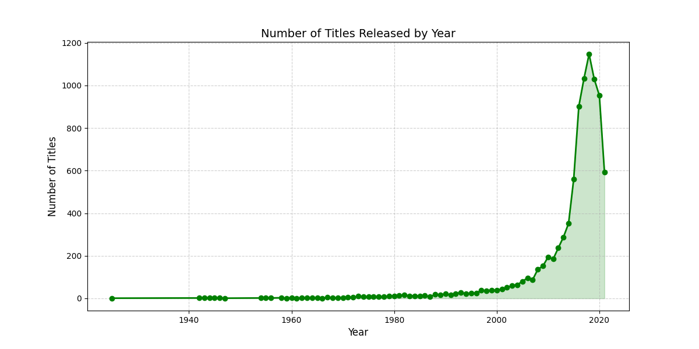
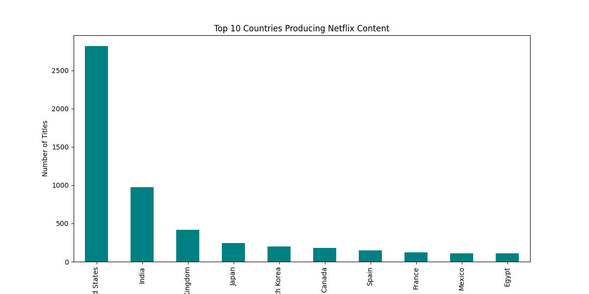

# 📊 Netflix Exploratory Data Analysis (EDA)

This project explores the **Netflix Titles Dataset** to uncover insights about the type, duration, release trends, and geographic distribution of Netflix content. The dataset contains metadata on Netflix movies and TV shows available up to 2021.

---

## 🔧 Tools & Libraries
- **Python**
- **Pandas** – data manipulation
- **Matplotlib** & **Seaborn** – data visualization

---

## 📂 Dataset
- **File:** `netflix_titles.csv`  
- **Source:** Kaggle – [Netflix Movies and TV Shows dataset](https://www.kaggle.com/shivamb/netflix-shows)

---

## 📈 Key Visualizations

### 1. Trend of Netflix Releases Over Time
Shows how the number of Netflix titles has grown yearly.  


---

### 2. Distribution of Movie Durations
Analyzes how long most Netflix movies are.  


---

### 3. Top 10 Countries Producing Netflix Content
Displays which countries contribute the most Netflix titles.  


---

## 📝 Summary of Insights
- Netflix content **increased sharply after 2015**, highlighting its global expansion.  
- Most movies are between **80–120 minutes long**, fitting the standard feature film length.  
- The **United States and India** dominate content production, but Netflix has expanded across many countries.  

---

## 🚀 How to Run
1. Clone this repository:
   ```bash
   git clone https://github.com/johnrachel592/netflix-eda.git

2. Install dependencies:

pip install pandas matplotlib seaborn jupyter


3. Open Jupyter Notebook:

jupyter notebook netflix_eda.ipynb


4. Run netflix_eda.ipynb

📜 License

This project is for educational purposes and uses publicly available datasets.

5. Author: Christopher Umunnakwe.


